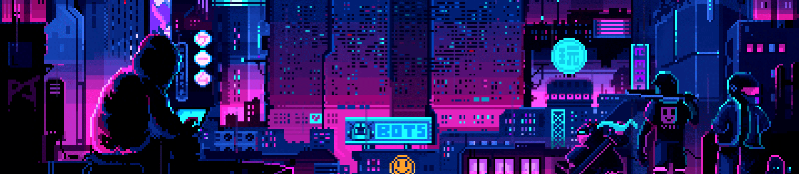
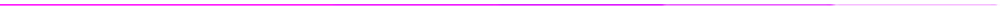
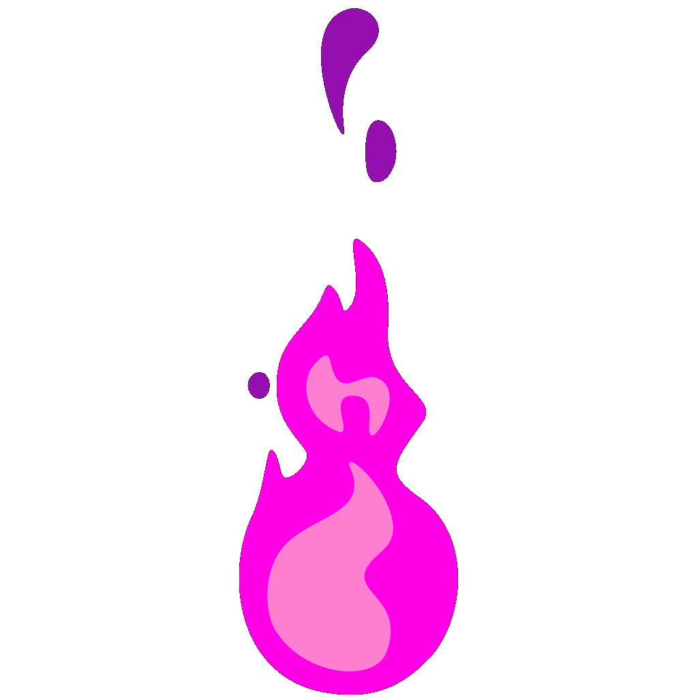
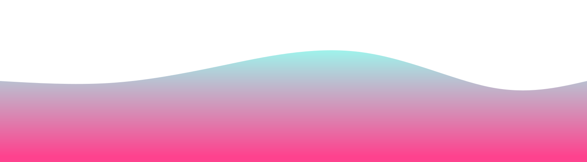

  
  
  

  
<b>Profile Views</b>

  

<h2></h2>

<h2 align="center"> Self-taught  and passionate  about coding! </h2> 

-   👨‍💻 I'm Danu Kim (DogeLord081👋, a high school student in Rhode Island, United States of America.    

-   🌳 I’m currently learning AI and ML using Python.    

-   🌊 2024 Goals: Turn OneReality into a real startup with PROJECT M.I.T.S.U.H.A.    

-   ☕ Interest: Math, Computer Science, Music, and Coding.    

-    Hobbies: Tennis, Flute, Piano, Anime, Manga, and Gaming.   

<h2></h2>

   

  
  
  
  <h2> <strong> ⚙️ Technologies and Skills </strong></h2>
   
  
  
   

  
   

<h2></h2>

<!-- 

<h2 align="center">💻 Workspace</h2>

|                                                               👩‍💻 Device                                                               |                                                                                                                                                                                                                                                                                                                ⚙️ Specification                                                                                                                                                                                                                                                                                                                |                                                                                                                                         📃 Purpose                                                                                                                                         |
| :----------------------------------------------------------------------------------------------------------------------------------: | :-------------------------------------------------------------------------------------------------------------------------------------------------------------------------------------------------------------------------------------------------------------------------------------------------------------------------------------------------------------------------------------------------------------------------------------------------------------------------------------------------------------------------------------------------------------------------------------------------------------------------------------------: | :---------------------------------------------------------------------------------------------------------------------------------------------------------------------------------------------------------------------------------------------------------------------------------------: |
|  |      |    |

<h2></h2>

   

 -->

  <h2> 🏆 My Github Stats </h2> 
    <h2></h2> 
  
  

  

  

 

<h2></h2>

  <h2 align="center">👨‍💻 Projects </h2> 
  
  

 

<h2></h2>

  <h2 align="center">✉️ Contact </h2>
  
  &nbsp
  

<!--  -->

